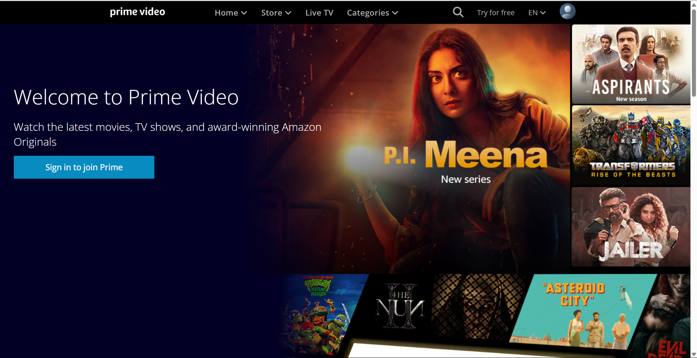
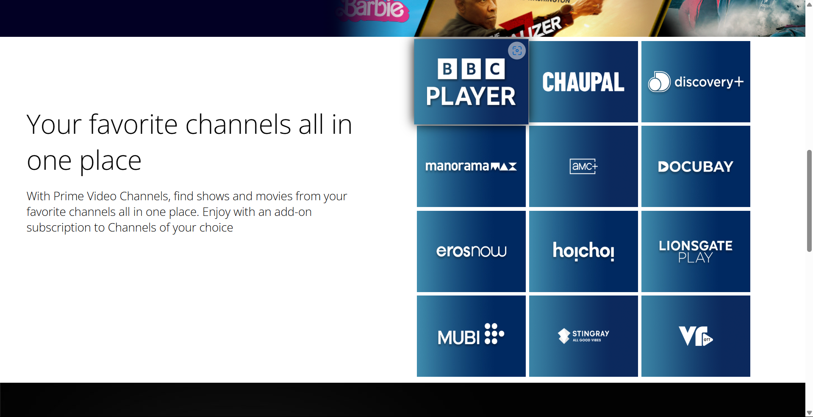
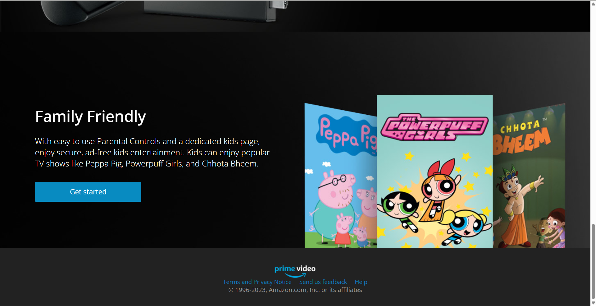

# Amazon Prime Videos

A basic HTML, CSS, and JavaScript project that replicates the user interface of Amazon Prime Video.

[Live Demo](https://amazon-prime-videos-html-css.netlify.app/)

---

## Overview
This project demonstrates:
- A responsive design similar to Amazon Prime Video.
- Functional sections like banners, carousels, and category listings.
- Clean and visually appealing layout for video streaming platforms.

---

## Features
- **Responsive Layout:** Works seamlessly on desktop, tablet, and mobile devices.
- **Video Categories:** Organized sections for better navigation.
- **Interactive UI:** Hover effects and transitions for an engaging experience.

---

## Technologies Used

### Frontend
- **HTML5:** Structured content.
- **CSS3:** Styling and responsive design.
- **JavaScript:** Dynamic functionality and interactivity.

### Hosting
- Hosted on Netlify: [Live Demo](https://amazon-prime-videos-html-css.netlify.app/)

---

## Installation

### Steps
1. Clone the repository:
   ```bash
   git clone https://github.com/shubham-jaishu/Amazon_Prime_Videos.git
   ```

2. Navigate to the project directory:
   ```bash
   cd Amazon_Prime_Videos
   ```

3. Open the `index.html` file in your browser:
   ```bash
   open index.html
   ```

---

## How It Works
1. **Static Content:** Replicates the structure and design of Amazon Prime Video.
2. **Responsive Design:** Adjusts layout based on screen size.
3. **Interactive Elements:** Smooth transitions and hover effects enhance the user experience.

---

## Preview




---

## Future Improvements
- Add video player functionality with playback controls.
- Integrate dynamic content using JavaScript or APIs.
- Implement a dark/light mode toggle for accessibility.

---

## Contribution
Contributions are welcome! Feel free to fork the repository and submit a pull request.

---

## Contact
For queries or feedback, please contact [Shubham](mailto:shubhamjaishu@gmail.com).
